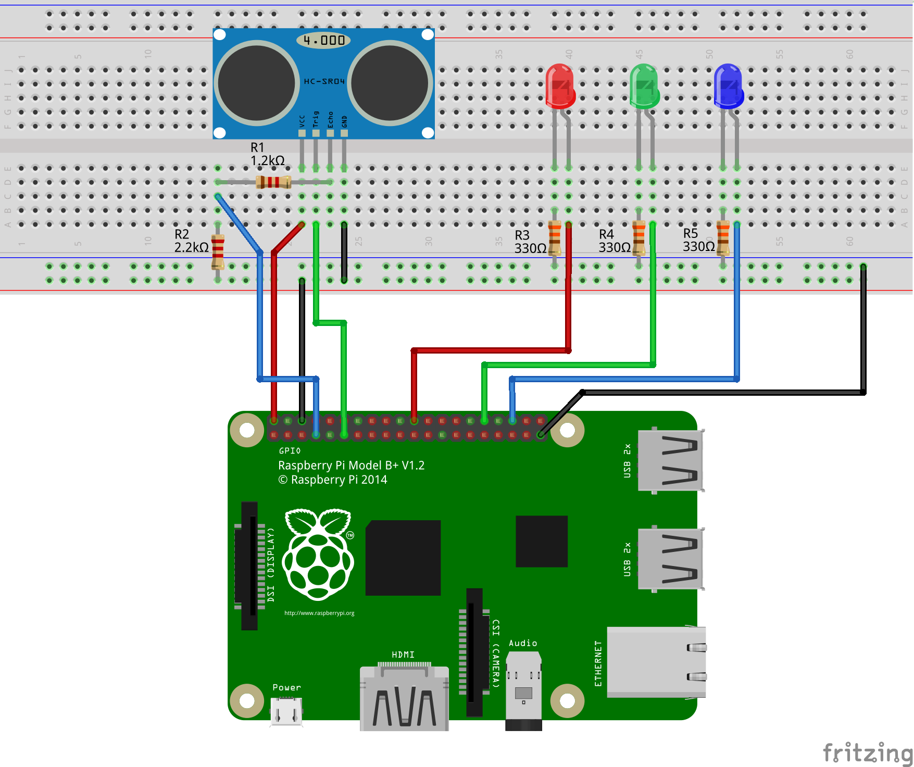

# Parking monitor

Parking monitor for Spot servers is a device for tracking the status
of parking spots and reporting updates to servers.

## Software

Parking monitor program is implemented using the Go programming
language and a Go library for accessing GPIO pins on the Raspberry Pi.

### Remote programming
In order to program the monitor from a remote workstation, the steps are:

1. Edit the `transfer.sh` file, set the environment variables
   that determine device's IP address, ARM version etc.
2. Make changes to Go files on the remote workstation.
3. Run `make transfer`. This will cross compile the program for ARM
   architecture and transfer the binary over a secure connection using `scp`.
4. Connect to the RPi using `ssh`.
5. Run the program with wanted options. Run the program with flag `-help`
   in order to see what options are available.

## Hardware

Device is assembled using the following components:

* Raspberry Pi 3 Model B+
* HC-SR04 ultrasonic sensor
* One 1.2 kOhm resistor (1 kOhm would also work)
* One 2.2 kOhm resistor (2 kOhm would also work)
* Three LEDs - red, green and blue
* Three 330 Ohm resistors
* Breadboard
* Eight male/female jumper wires
* One male/male jumper wire

Components are connected as presented on the picture below:

* HC-SR04 Vcc pin connects to the physical pin 2 (Vcc)
* HC-SR04 Trigger pin connects to the physical pin 11 (BCM pin 17)
* HC-SR04 Echo pin connects to the physical pin 7 (BCM pin 4)
  through a voltage divider
* HC-SR04 GND pin connects to the ground line on the breadboard
* Anode of the red LED connects to physical pin 22 (BCM pin 25)
* Anode of the green LED connects to physical pin 32 (BCM pin 12)
* Anode of the blue LED connects to physical pin 36 (BCM pin 16)
* Cathode of every LED connects to the ground line on the breadboard

